# Användarguide

Den här guiden visar hur du loggar in, väljer lösenord, laddar upp dokument
och ställer frågor om dem.

Tjänsten är en assistent för dina egna dokument. Du laddar upp rapporter,
beslut, e-post eller andra dokument och kan sedan ställa frågor på vanlig
svenska. Svaren bygger bara på dina dokument, och varje svar visar vilka
dokument det kommer från.

Dina dokument krypteras med en nyckel som bara ditt lösenord kan låsa upp.
Ingen annan användare kan se dem, inte heller administratören.

---

## 1. Logga in första gången

Administratören skapar ditt konto och ger dig ett **användarnamn** och ett
**tillfälligt lösenord**.

1. Öppna tjänstens adress i webbläsaren.
2. Skriv användarnamnet och det tillfälliga lösenordet.
3. Klicka på **Logga in**.

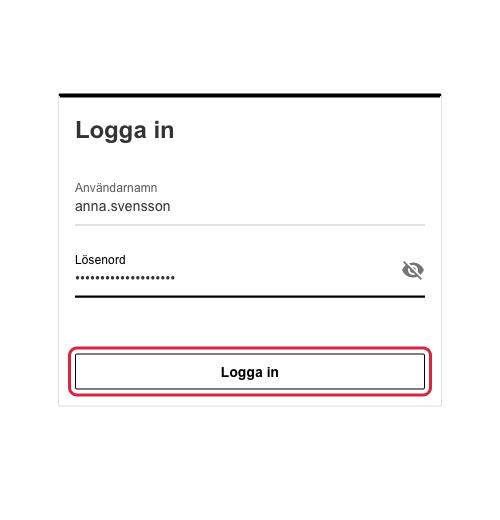

---

## 2. Välj ditt eget lösenord

Första gången du loggar in måste du byta det tillfälliga lösenordet mot ett
eget.

1. Skriv ett nytt lösenord på **minst 12 tecken**.
2. Skriv samma lösenord en gång till.
3. Klicka på **Spara lösenord**.

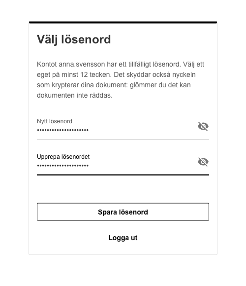

> **Viktigt: glöm inte lösenordet.** Lösenordet är också nyckeln till dina
> dokument. Om du glömmer det kan administratören ge dig ett nytt lösenord,
> men då raderas alla dina dokument och du får börja om med ett tomt
> bibliotek. Ingen kan återställa dem.

Tips: ett bra lösenord är långt och lätt att komma ihåg, till exempel några
ord med bindestreck emellan. Använd inte samma lösenord som i andra tjänster.

Efter det här steget är du inloggad. Nästa gång räcker det med användarnamn
och ditt eget lösenord. Inloggningen tar ett par sekunder, eftersom nyckeln
till dina dokument låses upp.

---

## 3. Startsidan

Efter inloggningen kommer du till startsidan. Där ställer du frågor. Överst
till höger finns två flikar:

- **Fråga**: här ställer du frågor om dina dokument.
- **Dokument**: här laddar du upp och ser dina dokument.

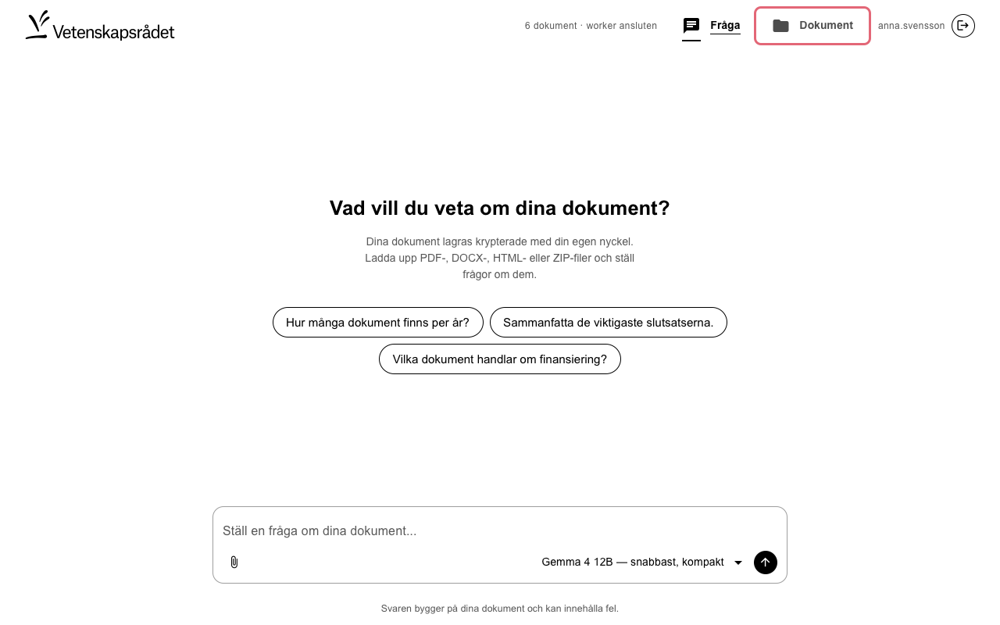

Innan du kan ställa frågor behöver du ladda upp dokument. Det gör du under
**Dokument**, så klicka där.

---

## 4. Ladda upp dokument

### Välj filer

På sidan **Dokument** klickar du på **Ladda upp** och väljer en eller flera
filer. Du kan välja många filer på en gång, upp till 5 000.

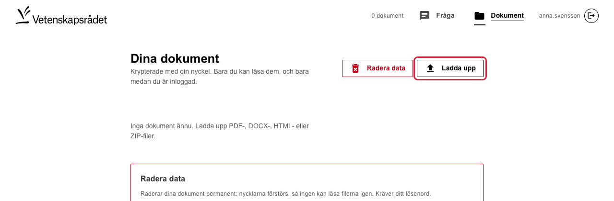

**Filer som fungerar:**

| Filtyp | Kommentar |
|---|---|
| **PDF** | Rapporter, beslut, utlysningar m.m. Högst 50 MB per fil. |
| **Word (DOCX)** | Högst 50 MB per fil. |
| **HTML** | Till exempel e-post som sparats från ett ärendesystem, även om filen heter `.pdf`. |
| **ZIP** | Ett arkiv med många dokument, högst 500 MB. Se nedan. |

Skannade PDF:er utan textlager, alltså bilder av sidor, kan inte läsas. Då
visas "Ingen text kunde extraheras".

### Följ uppladdningen

Varje fil får en rad med namn, status och förloppsindikator.

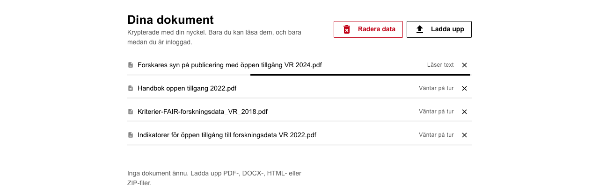

| Status | Betyder |
|---|---|
| **I kö** | Filen väntar på att skickas. |
| **Laddar upp · 45 %** | Filen skickas från din dator. |
| **Väntar på tur** | Filen har kommit fram och väntar på att bearbetas. |
| **Läser text · sida 12 av 80** | Texten tas ut ur dokumentet. |
| **Analyserar · 20 av 55 avsnitt** | Texten görs sökbar. |
| **Krypterar och sparar** | Dokumentet krypteras och sparas. |
| **Klar** | Dokumentet finns i ditt bibliotek. |

När en fil är klar dyker den upp i listan nedanför.

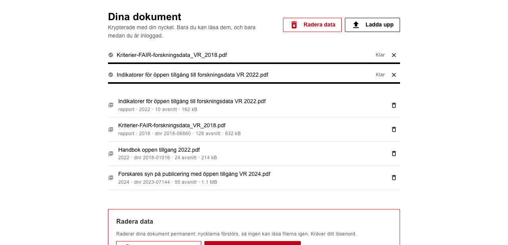

- **Avbryta:** klicka på **✕** på raden. Laddar du upp många filer på en gång
  visas i stället en sammanfattning med knappen **Avbryt alla**.
- **Stäng inte sidan** medan filer skickas (**I kö** eller **Laddar upp**),
  för då avbryts överföringen. Webbläsaren varnar om du försöker. När filen
  väl har kommit fram kan du gå till andra sidor; bearbetningen fortsätter.
- **Samma dokument två gånger** läggs inte in igen. Då står det "Dokumentet
  finns redan i biblioteket".

### Ladda upp en ZIP-fil

Har du många dokument går det ofta enklast att packa dem i en ZIP-fil och
ladda upp den. Arkivet visas som en rad som räknar filerna.

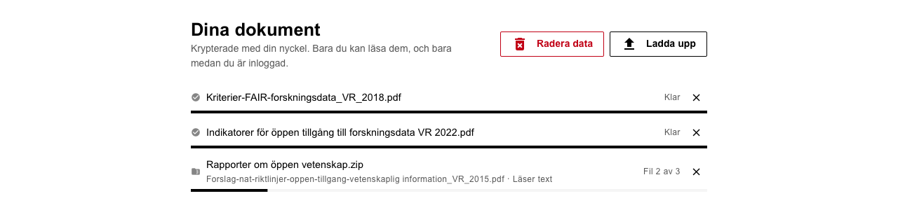

När arkivet är klart står det hur det gick: hur många dokument som lästes
in, hur många som redan fanns, och vilka som inte gick att läsa och varför.
Filer som inte är dokument, till exempel bilder och kalkylark, hoppas över.
Raden ligger kvar tills du stänger den med **✕**.

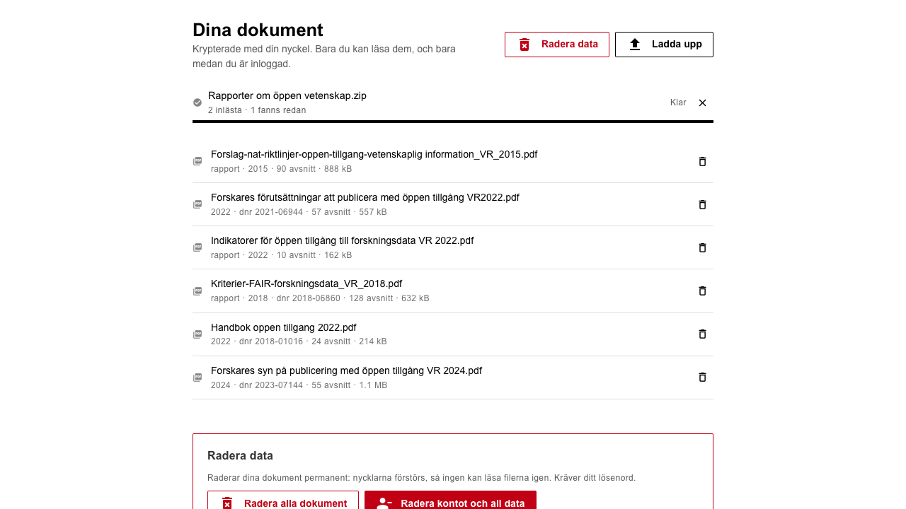

### Dokumentlistan

Listan visar dina dokument med filnamn, typ, år och diarienummer, de
senast uppladdade först. Har du fler än 50 dokument delas listan upp i sidor
som du bläddrar mellan med pilarna ovanför listan. Papperskorgen till höger tar bort ett
dokument.

> **Originalfilerna sparas inte.** Tjänsten sparar bara den text som behövs
> för att svara på frågor, krypterad. Behåll därför dina originalfiler där du
> har dem i dag. Svaren talar om vilket dokument du ska titta i.

---

## 5. Ställ frågor

Gå till **Fråga**, skriv din fråga i rutan längst ned och tryck **Enter**
eller klicka på pilen.

Först söker tjänsten fram de avsnitt i dina dokument som passar bäst. Sedan
läser språkmodellen dem och skriver ett svar. Medan den läser ser du hur
många dokument den går igenom. Det tar oftast mellan några sekunder och en
minut, men med stora underlag kan det ta några minuter.

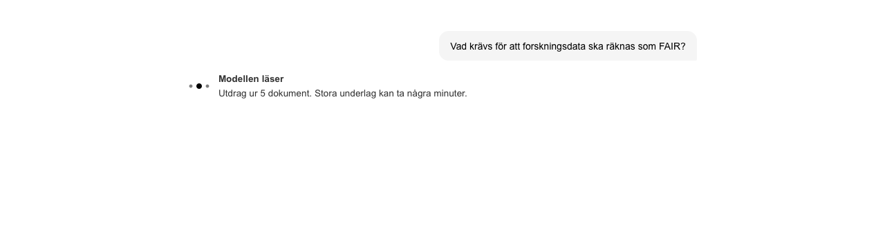

Svaret skrivs fram medan det blir klart.

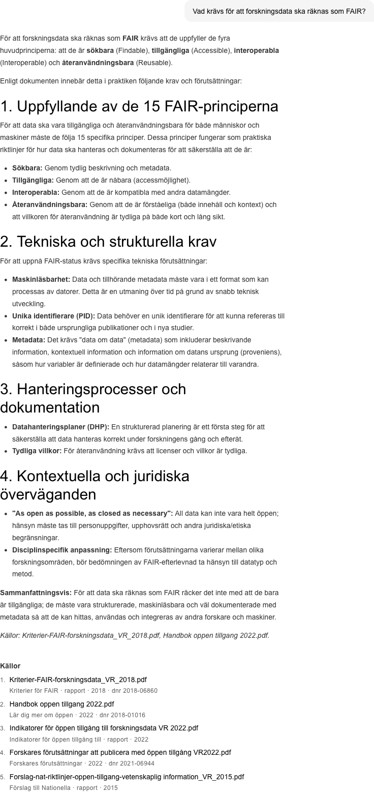

### Källor

Under varje svar finns en lista med **Källor**: de dokument svaret bygger
på, med filnamn, titel, dokumenttyp, år och diarienummer. Där ser du vilket
dokument du ska läsa om du vill kontrollera något eller läsa mer.

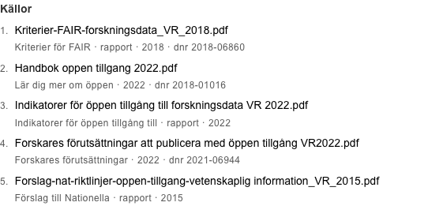

> Svaren skrivs av en språkmodell och kan innehålla fel. Kontrollera viktiga
> uppgifter i källdokumenten.

### Olika sorters frågor

| Du vill | Skriv till exempel |
|---|---|
| Veta vad dokumenten säger om något | *Vad säger dokumenten om öppen tillgång?* |
| Få en sammanfattning eller rekommendation | *Sammanfatta slutsatserna om karriärvägar för unga forskare.* |
| Hitta vilka dokument som tar upp något | *Vilka dokument handlar om forskningsinfrastruktur?* |
| Hitta ett exakt ord eller uttryck | *Vilka dokument innehåller "Plan S"?* Sätt uttrycket inom citattecken. Då söks alla dokument igenom ord för ord, och antalet träffar blir exakt. |
| Räkna och jämföra | *Hur många dokument finns per år?* eller *Fördelning per dokumenttyp?* |

Frågor om antal och fördelning besvaras med exakta siffror för hela
biblioteket, ofta med ett diagram. Källistan talar då om att svaret bygger på
uppgifter om alla dokument och inte på enskilda dokument.

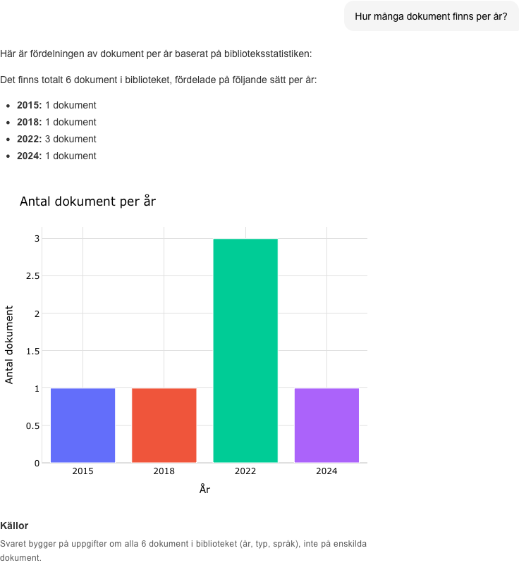

### Följdfrågor

Du kan fortsätta samtalet med följdfrågor, till exempel *Förklara den andra
punkten närmare* eller *Och per dokumenttyp?*. Tjänsten minns de tre senaste
frågorna och svaren i samtalet. Före sökningen tolkas följdfrågan som en
fristående fråga, och tolkningen visas under din fråga ("Tolkad som: …"), så
att du kan se vad som faktiskt söktes efter. Blev tolkningen fel kan du
ställa frågan igen med fler ord.

Byter du ämne klickar du på **Ny konversation** till vänster under
frågerutan. Då glöms de tidigare frågorna, och nästa fråga besvaras helt för
sig. Samtalet glöms också när du loggar ut.

Tips:

- Fråga konkret och använd de ord som står i dokumenten.
- Hela frågor fungerar bättre än lösa sökord.
- Med rullistan bredvid pilen kan du välja en annan språkmodell. Större
  modeller ger ofta bättre svar men tar längre tid.

---

## 6. Logga ut

Klicka på knappen längst upp till höger för att logga ut. Då låses dina
dokument och samtalet försvinner.

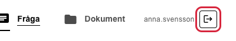

Du loggas också ut automatiskt efter **30 minuter** utan aktivitet och
senast efter 12 timmar. Loggar du in från en annan dator ligger samtal från
tidigare inloggningar inte kvar.

---

## 7. Byta lösenord

Gå till **Dokument**, rulla ned och öppna **Konto och säkerhet**. Skriv ditt
nuvarande lösenord och det nya två gånger. Klicka sedan på **Byt lösenord**.

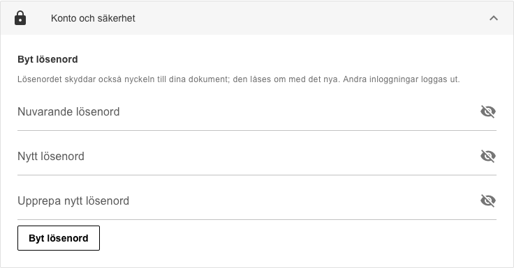

Dina dokument finns kvar och låses upp med det nya lösenordet. Är du inloggad
på andra ställen loggas de inloggningarna ut.

---

## 8. Radera data

Du kan när som helst radera dina data. Klicka på **Radera data** överst på
sidan **Dokument**, eller använd rutan **Radera data** längre ned.

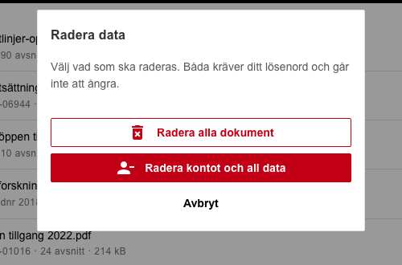

- **Radera alla dokument:** tömmer ditt bibliotek. Kontot och lösenordet
  finns kvar.
- **Radera kontot och all data:** raderar kontot, nyckeln och alla dokument,
  och du loggas ut.

Båda kräver ditt lösenord och att du skriver **RADERA**. Det går inte att
ångra.

---

## Vanliga frågor

**Jag har glömt mitt lösenord.**
Kontakta administratören. Du får ett nytt tillfälligt lösenord, men dina
dokument raderas och du behöver ladda upp dem igen.

**Det står "För många misslyckade försök".**
Efter fem felaktiga lösenord spärras kontot i 15 minuter. Vänta och försök
igen.

**En fil gick inte att ladda upp.**
Läs meddelandet på raden:

- *"Filen är varken PDF, DOCX, HTML eller ZIP"*: filtypen stöds inte, även om
  filnamnet slutar på `.pdf`.
- *"Ingen text kunde extraheras"*: dokumentet är troligen skannat och har
  ingen text att läsa.
- *"Filen är för stor"*: högst 50 MB per fil och 500 MB per ZIP-fil.
- *"Filen är lösenordsskyddad"*: ta bort lösenordsskyddet och ladda upp igen.

**Svaret hittar inte det jag vet finns i ett dokument.**
Formulera om frågan med ord som står i dokumentet, eller sök på ett exakt
uttryck inom citattecken.

**Jag loggades plötsligt ut.**
Det händer efter 30 minuters inaktivitet och om lösenordet har bytts på
något annat ställe. Logga in igen.
